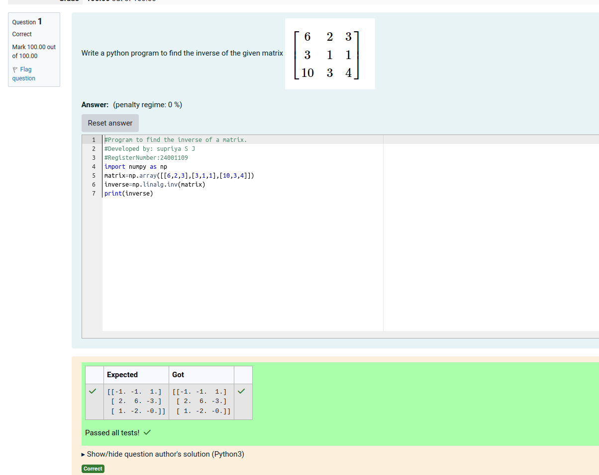

# INVERSE-OF-A-MATRIX
## Aim:
To write a python program to find the inverse of a matrix
## Equipment’s required:
1. 	Hardware – PCs
2. 	Anaconda – Python 3.7 Installation / Moodle-Code Runner
## Algorithm:

### Step1 : 

Import numpy module from python library as np

### Step 2:

Define the matrix using np.array([],[],[]) as "a"

### Step 3: 

Find the inverse of the matrix by np.linalg.inv(a) and store the values as "b"

### Step 4: 

Display the solution by using print function

## Program:

#Program to find the inverse of a matrix.

#Developed by: supriya S J

#RegisterNumber:24001109

import numpy as np

matrix=np.array([[6,2,3],[3,1,1],[10,3,4])

inverse=np.linalg.inv(matrix)

print(inverse)

## Output:

## Result:
Thus the inverse of given matrix is successfully solved using python program

